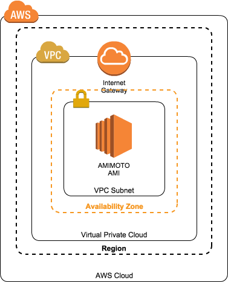
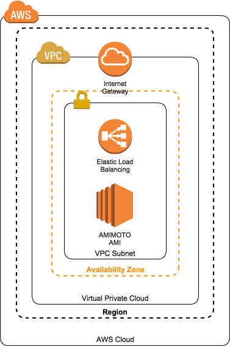
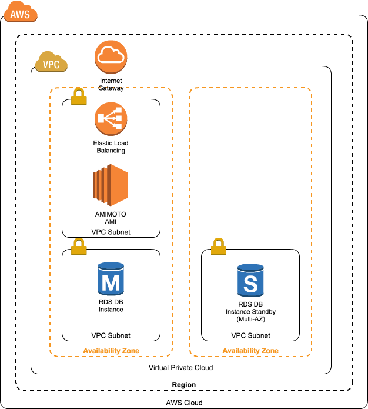

# amimot-enterprise-cfn
##About Branch

- master :リリース版
- staging :結合テスト
- topicbranch :単体テスト

##Params
###KeyName
**Required**
SSH KeyName.

###MailAddress
**Required**
Your Email Address.
Send to CloudWatch Alert Mail.

###InstanceType
Default:t2.small
EC2 Instance Size.

##Stack List
###Sardine
This is Simple AMIMOTO Stack made by CloudFormation.
Easy Setup and Automatic make Snapshot(2Days).
Use service is VPC,EC2,EIP,CloudWatch.

```
kumogata create sardine.rb sardine \
 -r REGION \
   -p "KeyName=KEYNAME,InstanceType=INSTANCE_TYPE,MailAddress=example@EXAMPLE.COM"  --capabilities=CAPABILITY_IAM
```

###Stack2（名前募集中）
This is Powerful AMIMOTO Stack made by CloudFormation.
Using CDN(CloudFront),the server is more durable.
Easy Setup and Automatic make Snapshot(2Days).
Use service is VPC,EC2,EIP,CloudWatch,CloudFront.

```
kumogata create stack2.rb stack2 \
 -r REGION \
   -p "KeyName=KEYNAME,InstanceType=INSTANCE_TYPE,MailAddress=example@EXAMPLE.COM"  --capabilities=CAPABILITY_IAM
```

###Stack3（名前募集中）
This is Powerful AMIMOTO Stack made by CloudFormation.
Using S3 & CDN, you can upload many media file.
Easy Setup and Automatic make Snapshot(2Days).
Use service is VPC,EC2,EIP,CloudWatch,CloudFront,S3.

```
kumogata create stack3.rb stack3 \
 -r REGION \
   -p "KeyName=KEYNAME,InstanceType=INSTANCE_TYPE,MailAddress=example@EXAMPLE.COM"  --capabilities=CAPABILITY_IAM
```

##How To Build

###Simple EC2 Stack(HVM)
VPC内にEC2を一台設置したシンプルなAMIMOTOスタックです。

```
kumogata create simple-ec2-hvm.rb STACKNAME \
 -r REGION \
 -p "KeyName=KEYNAME,InstanceType=INSTANCE_TYPE"
```

###Okehazama(HVM)
VPC内にEC2を１台設置し、前面にELBを配置したAMIMOTOスタックです。

```
kumogata create okehazama-hvm.rb STACKNAME \
 -r REGION \
 -p "KeyName=KEYNAME,InstanceType=INSTANCE_TYPE"
```
元ネタ：[桶狭間合戦](https://ja.wikipedia.org/wiki/%E6%A1%B6%E7%8B%AD%E9%96%93%E3%81%AE%E6%88%A6%E3%81%84)

###Kawanakajima(HVM)
OkehazamaにマルチA-ZのRDSを追加したAMIMOTOスタックです。
MariaDBを使用し、通常のMySQL RDSより高いパフォーマンスを期待できます。

```
kumogata create kawanakajima-hvm-maria.rb STACKNAME \
 -r REGION \
-p "KeyName=KEYNAME,MySQLPassword=MYSQLPASS,MulitiAZDatabase=TRUE,RDSInstanceType=DB_INSTANCE_TYPE,InstanceType=EC2_INSTANCE_TYPE"
```
###Tedorigawa(HVM)
KawanakajimaのRDSをAmazon Auroraに切り替えたAMIMOTOスタックです。
MySQLの5倍のパフォーマンスを堪能されたい方にオススメです。
```
kumogata create kawanakajima-hvm-aurora.rb STACKNAME \
 -r REGION \
-p "KeyName=KEYNAME,MySQLPassword=MYSQLPASS,MulitiAZDatabase=TRUE,RDSInstanceType=DB_INSTANCE_TYPE,InstanceType=EC2_INSTANCE_TYPE"
```

###Anegawa(HVM)
CloudFrontが追加されたスタックです。
CloudFrontを操作するためのプラグインの設定が必要となります。
```
kumogata create anegawa-hvm-aurora.rb STACKNAME \
 -r REGION \
-p "KeyName=KEYNAME,MySQLPassword=MYSQLPASS,MulitiAZDatabase=TRUE,RDSInstanceType=DB_INSTANCE_TYPE,InstanceType=EC2_INSTANCE_TYPE"
```

###Osaka(HVM)
S3が追加されたスタックです。
CloudFrontとS3を操作するためのプラグインの設定が必要となります。
```
kumogata create osaka-hvm-aurora.rb STACKNAME \
 -r REGION \
-p "KeyName=KEYNAME,MySQLPassword=MYSQLPASS,MulitiAZDatabase=TRUE,RDSInstanceType=DB_INSTANCE_TYPE,InstanceType=EC2_INSTANCE_TYPE"
```

###Mikatagahara(HVM)
CloudWatchによるリソース監視体制を追加する予定です。

###Tennosan(HVM)
Elasticacheを追加する予定です。

###Sekigahara(HVM)
AWS WAFを追加する予定です。

###Tsushima(HVM)
CodeDeploy + AutoScaleを追加する予定です。
元ネタ:[日本海海戦](https://ja.wikipedia.org/wiki/%E6%97%A5%E6%9C%AC%E6%B5%B7%E6%B5%B7%E6%88%A6)
