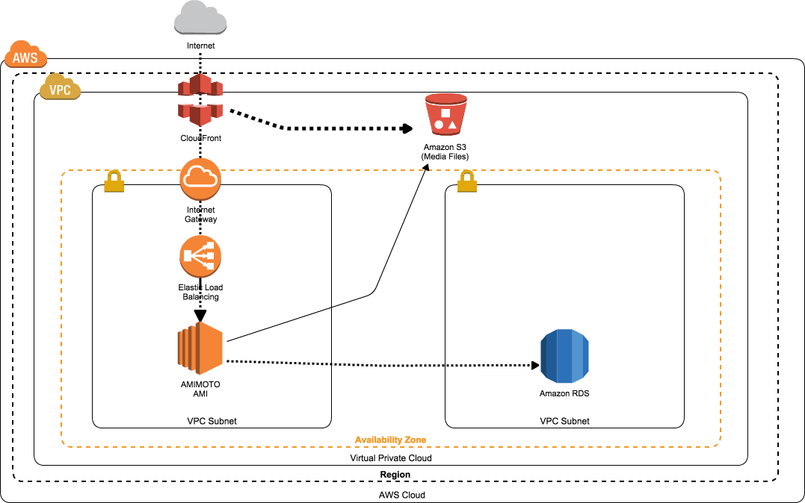

# amimot-enterprise-cfn
##About Branch

- master :リリース版
- staging :結合テスト
- topicbranch :単体テスト

##Stack List
###Simple AMIMOTO Stack(HVM)
###Title

>Title	of	the	topology,		This	appears	in	the	detail	page,	fulfillment	page,	and	pop	up	that	shows	the	topology	details

###Option Order
*何書けばいいんだろう・・・*
####ドキュメント引用
>If	product	contains cluster	options, specify	the	order	to	display


###Short Description(JA)
WordPressをより高いパフォーマンスで運用できる最もシンプルなCloudFormationスタックです。
ハイパフォーマンスを発揮できるようにチューニングされたAMIMOTO AMIとAWSサービスを組み合わせることで、
高い耐障害性を持つハイパフォーマンスなWordPressサイトを実現します。


###Description(JA)
WordPressを高いパフォーマンスと耐障害性で運用するために開発されたCloudFormationスタックです。
RDSにDBデータ、S3にメディアファイルを保存することでWordPressが稼働するサーバーに障害が発生した場合にも簡単に復旧することが可能となりました。
またCloudFrontをサイトの前面に設置することでサーバーへの負荷を削減し、同時に海外からのアクセスにも低いレイテンシで対応します。
WordPressが稼働するEC2サーバーには徹底したチューニングが実施されたAMIMOTO AMIを使用、
大規模Webサイトの運用にも耐えることができるWordPressインフラストラクチャを簡単に構築することが可能です。

###Description

####Topology Diagram

```
kumogata create stack001.rb STACKNAME \
 -r REGION \
 -p "KeyName=KEYNAME,InstanceType=INSTANCE_TYPE,MySQLPassword=PASSWORD,MulitiAZDatabase=TRUEorFALSE,RDSInstanceType=RDS_INSTANCE_TYPE" \
 --capabilities=CAPABILITY_IAM
```


##Params

| Param Name | Default or Required | Description |
|:--|:--|
| KeyName | **Required** | SSH KeyName. |
| InstanceType | **Default:t2.small** | EC2 Instance Size. |
| MySQLPassword | **Required** | Database Password. |
| MulitiAZDatabase | **Default: false** | Define RDS Muliti-AZ Database. |
| RDSInstanceType | **Default: db.m3.medium** | RDS Instance Size. |
